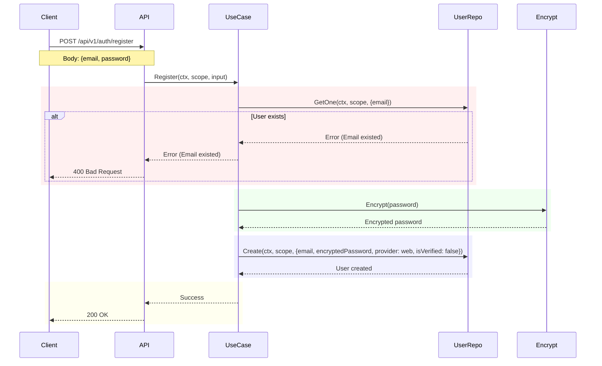
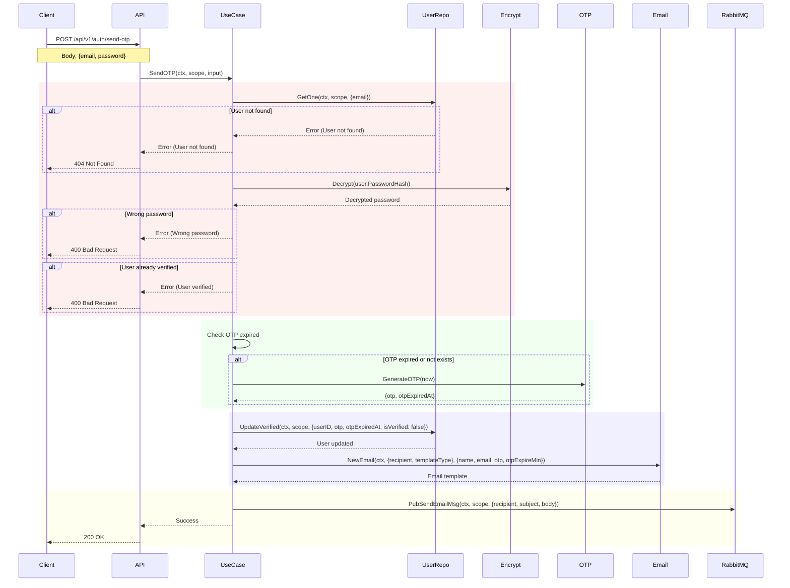
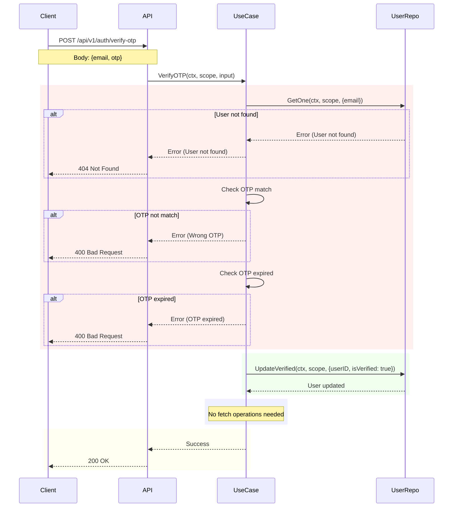
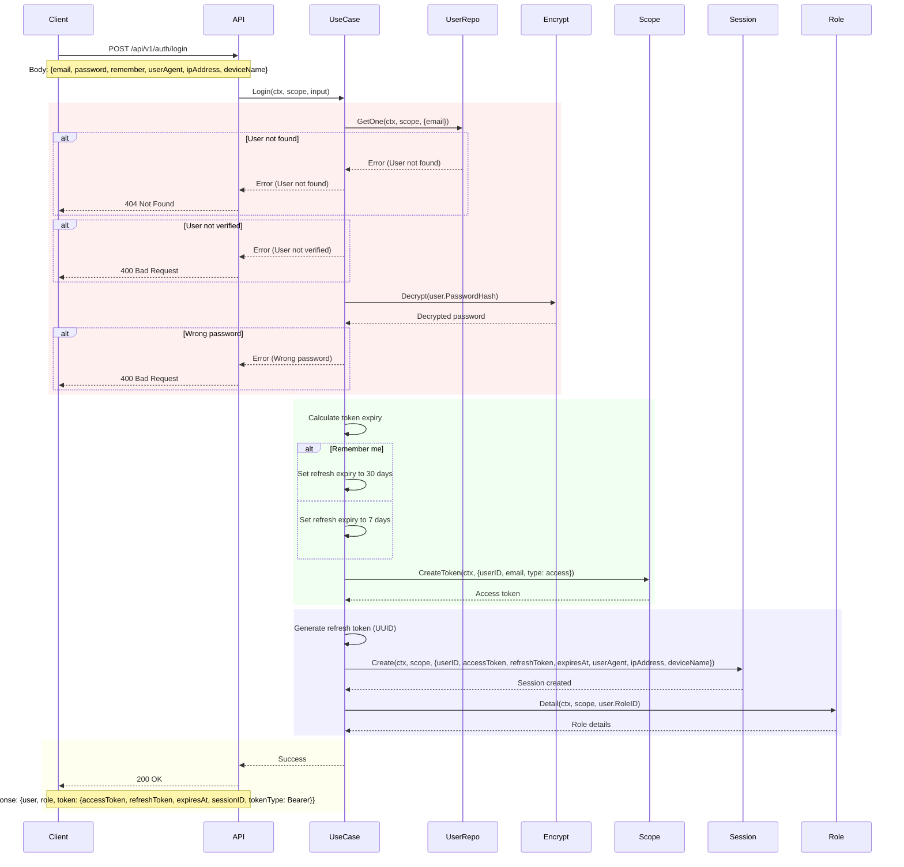
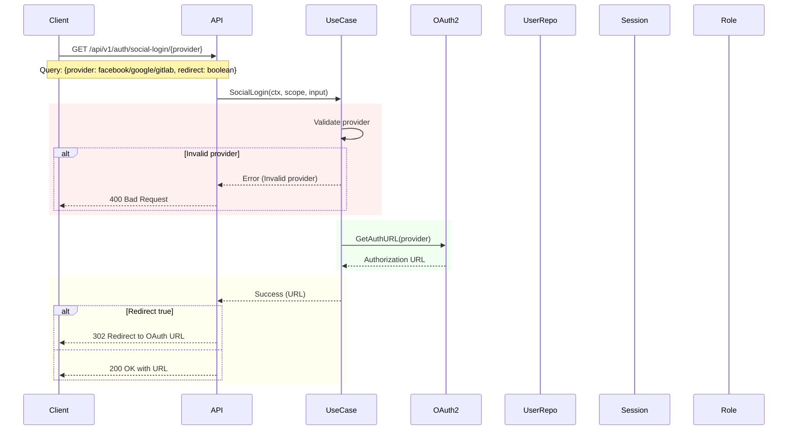
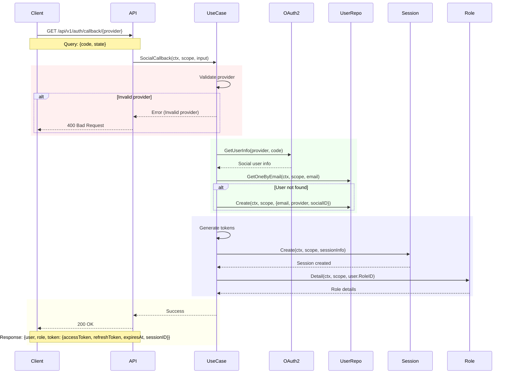
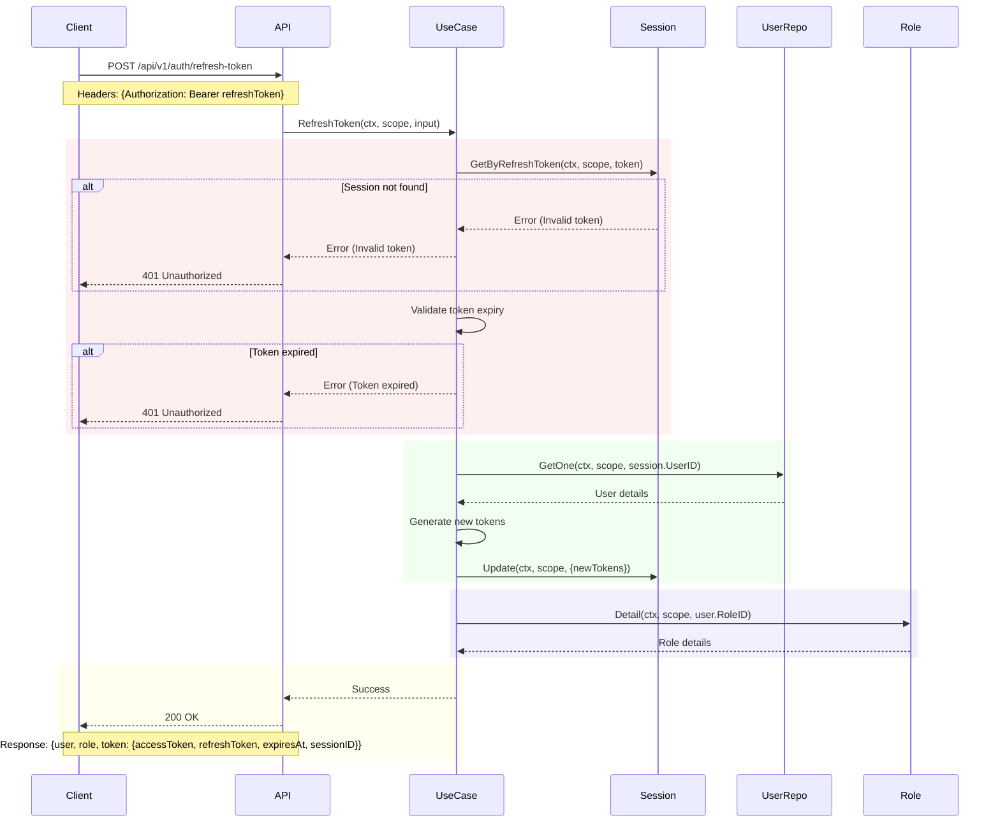
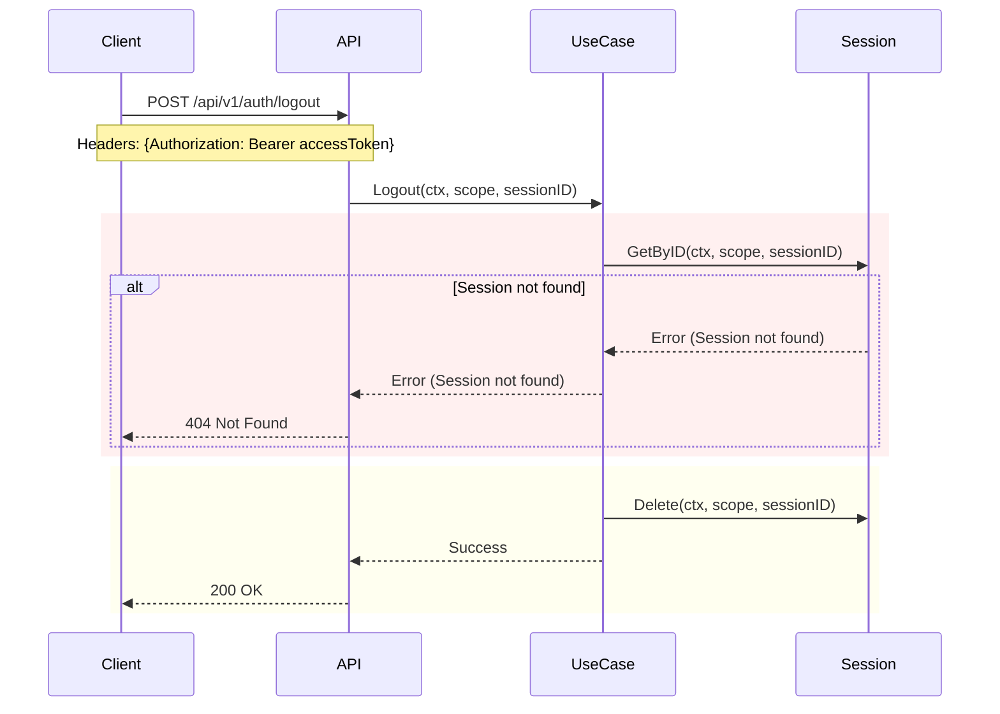
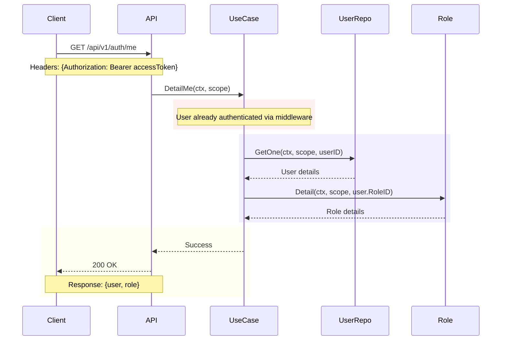

# Authentication API Flow

## 1. Register API Flow

## 2. Send OTP API Flow

## 3. Verify OTP API Flow

## 4. Login API Flow

## 5. Social Login API Flow

## 6. Social Callback API Flow

## 7. Refresh Token Flow

## 8. Logout Flow

## 9. Get User Profile Flow

## Key Points

### Register API
- Check if email already exists
- Encrypt password before storing
- Create new user with unverified status
- No OTP generation during registration

### Send OTP API
- Verify user existence
- Decrypt and authenticate password
- Check OTP validity and generate new if needed
- Create email template with OTP details
- Send email via RabbitMQ

### Verify OTP API
- Verify user existence
- Verify OTP matches stored OTP
- Check OTP expiration
- Update user verification status

### Login API
- Verify user existence and verification status
- Decrypt and authenticate password
- Generate access token with JWT
- Generate refresh token using UUID
- Create session with token details
- Get user role information
- Support remember me functionality
- Return user, role and token information

### Social Login API
- Validate social provider (Facebook/Google/GitLab)
- Get OAuth2 configuration for the provider
- Generate authentication URL with:
  - Random state parameter
  - Offline access type
  - Account selection prompt
- Return authentication URL to client

### Social Callback API
- Validate social provider
- Get user info from OAuth2 provider
- Check if user exists
- Create new user if not exists
- Verify provider and providerID
- Generate token and session
- Get user role information
- Return user, role and token information

### Common Features
- Use RabbitMQ for asynchronous email delivery
- Password encryption/decryption
- Error handling and logging
- Use scope for access control management
- Email template generation

### VAFP Pattern
Each API flow follows the VAFP (Verify, Authenticate, Fetch, Process) pattern:

1. **Verify Phase** (Red)
   - Input validation
   - Existence checks
   - Error conditions
   - Data validation

2. **Authenticate Phase** (Green)
   - Security checks
   - Password/OTP verification
   - Token generation
   - Provider validation

3. **Fetch Phase** (Blue)
   - Data retrieval
   - Session creation
   - Role fetching
   - User information gathering

4. **Process Phase** (Yellow)
   - Response preparation
   - Final processing
   - Success/error handling
   - Response sending
