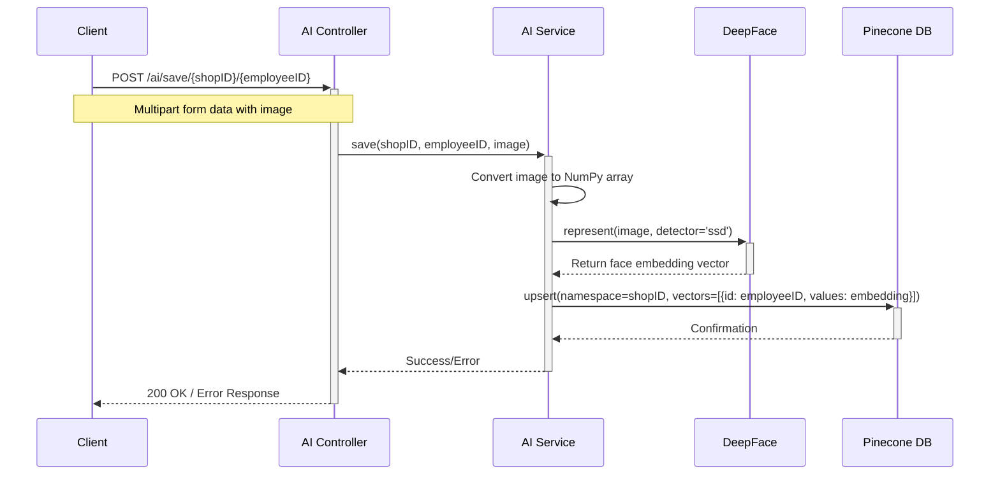
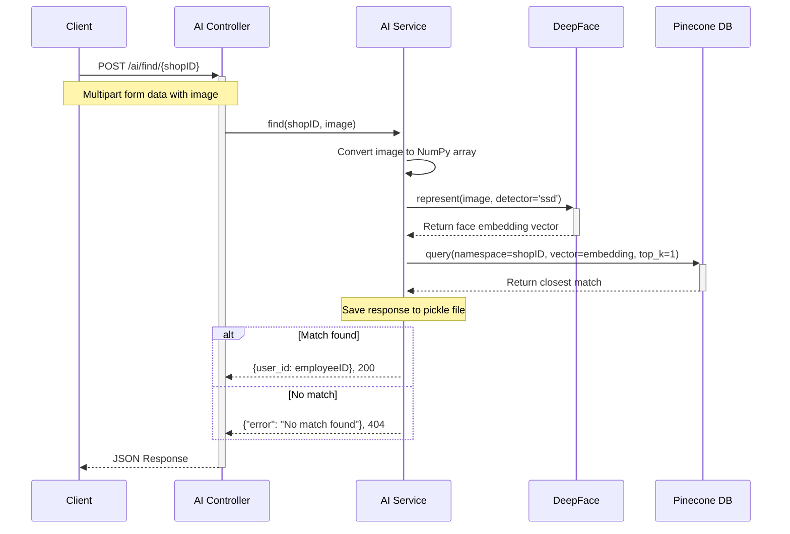
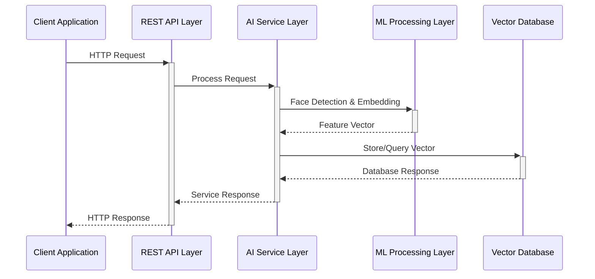

# Sequence Diagrams

## 1. Save Employee Face Image Flow

## 2. Find Employee by Face Flow

## 3. System Architecture Flow

## API Endpoints

### 1. Save Employee Face
- **Endpoint**: POST `/ai/save/{shopID}/{employeeID}`
- **Input**: 
  - Path Parameters:
    - `shopID`: Shop identifier
    - `employeeID`: Employee identifier
  - Body: Multipart form data
    - `image`: Image file
- **Process**:
  1. Validate image input
  2. Convert image to NumPy array
  3. Generate face embedding using DeepFace
  4. Store embedding in Pinecone DB with shop namespace
- **Response**:
  - Success: 200 OK
  - Error: 400 Bad Request / 500 Server Error

### 2. Find Employee
- **Endpoint**: POST `/ai/find/{shopID}`
- **Input**:
  - Path Parameters:
    - `shopID`: Shop identifier
  - Body: Multipart form data
    - `image`: Image file
- **Process**:
  1. Validate image input
  2. Convert image to NumPy array
  3. Generate face embedding using DeepFace
  4. Query Pinecone DB for closest match
  5. Save response for debugging
- **Response**:
  - Success: 200 OK with employee ID
  - Not Found: 404 Not Found
  - Error: 400 Bad Request / 500 Server Error

## Technical Details

### Face Processing
- Using DeepFace library with SSD detector backend
- Face embedding generation for feature extraction
- Vector dimension based on DeepFace model output

### Vector Database
- Using Pinecone for vector similarity search
- Namespace separation by shop ID
- Top-1 nearest neighbor search for identification
- Vector upsert for employee registration

### Error Handling
- Image validation
- Face detection verification
- Database operation error handling
- Detailed error logging for debugging 