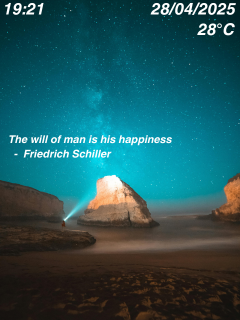

# FaceCheck-in-FreeRTOS-ESP32

## Giới thiệu
FaceCheck-in FreeRTOS ESP32 là một phần của dự án CO3109-Multidisciplinary_Project, được thiết kế để tạo ra một hệ thống điểm danh thông qua nhận diện khuôn mặt sử dụng ESP32 và màn hình TFT 2.0 inch. Hệ thống này tích hợp FreeRTOS để quản lý đa tác vụ hiệu quả.

> Version 1 available at: https://github.com/minh-le1710/FaceCheck-in

## RTOS Priority Task
| Task Name                 | Priority         | Core Affinity | Frequency / Trigger       | Notes                     |
|---------------------------|---------------------|---------------|--------------------------|---------------------------|
| MQTT Handler              | 4                 | Core 1        | On MQTT message (IRQ)    | Adafruit IO callback      |
| Buzzer & LED Control      | 3        | Core 0        | On event (semaphore)     | Non-blocking, short burst |
| Quote Update            | 2       | Core 0        | Every 1 hour (timer)        | Fetch daily quote via API    |
| Time & Weather Update     | 2               | Core 0        | Every 1 minute (timer)      | HTTP + NTP                |
| Display Update            | 1                | Core 1        | Every  1 minute                   | Draw clock & status       |

## State
> 320*240 Resolution

| Dashboard            | Success         | Fail |
|---------------------------|---------------------|---------------|
|         |              |       | 

## Tính năng chính
- Chụp ảnh khuôn mặt thông qua camera ESP32
- Hiển thị giao diện người dùng trên màn hình TFT ST7789
- Kết nối WiFi và MQTT để giao tiếp với server
- Xử lý phản hồi từ server AI và hiển thị kết quả
- Giao diện người dùng thân thiện với animation
- Tích hợp với hệ thống quản lý trung tâm
- Quản lý đa tác vụ với FreeRTOS

## Yêu cầu phần cứng
- ESP32 Development Board (ESP32-WROVER hoặc ESP32-CAM)
- Màn hình TFT ST7789 (2.0 inch, 320x240)
- Camera module (tích hợp hoặc rời)
- Nguồn điện 5V

## Yêu cầu phần mềm
- PlatformIO IDE
- Arduino framework
- FreeRTOS
- Các thư viện:
  - Adafruit GFX Library
  - Adafruit ST7735 and ST7789 Library
  - ArduinoJson
  - PubSubClient (MQTT)
  - DHT sensor library

## Cấu trúc thư mục
```
face-checkin-2/
├── src/                    # Mã nguồn chính
│   ├── main.cpp           # File chính
│   ├── 1.h, 2.h, 3.h     # Resource files cho giao diện
│   └── LoginSuccessfull.h # Resource cho màn hình thành công
├── include/               # Header files
├── lib/                   # Thư viện
├── test/                  # Unit tests
├── platformio.ini         # Cấu hình PlatformIO
└── huge_app.csv          # Cấu hình phân vùng bộ nhớ
```

## Getting Started with FaceCheck-in on PlatformIO

### 1. Clone Repository
```bash
# Clone the repo into a local folder
git clone https://github.com/minh-le1710/FaceCheck-in-ver2.git

# Change into the project directory
cd FaceCheck-in
```

### 2. Cấu hình
Trong file `platformio.ini`:
```ini
[env:esp32wrover]
platform = espressif32
board = esp32doit-devkit-v1
framework = arduino
board_build.partitions = huge_app.csv

lib_deps =
  adafruit/Adafruit GFX Library
  adafruit/Adafruit ST7735 and ST7789 Library
  bblanchon/ArduinoJson
  knolleary/PubSubClient
```

### 3. Build và Upload
```bash
# Build
platformio run --environment=esp32wrover

# Upload
platformio run --target=upload --environment=esp32wrover
```

### 4. Monitor Serial Output
```bash
platformio device monitor --environment=esp32wrover
```

## Kết nối phần cứng
- Màn hình TFT ST7789:
  - MOSI -> GPIO23
  - SCK -> GPIO18
  - CS -> GPIO5
  - DC -> GPIO16
  - RST -> GPIO17
  - BL -> GPIO4

## Tính năng giao diện
- Màn hình chờ với animation
- Hiển thị trạng thái kết nối WiFi và MQTT
- Màn hình chụp ảnh với preview
- Hiển thị kết quả nhận diện
- Animation cho trạng thái thành công/thất bại

## Tích hợp với hệ thống
- Kết nối với MQTT broker (Adafruit IO) để nhận/gửi dữ liệu
- Gửi ảnh đến AI service để xử lý
- Nhận kết quả và cập nhật trạng thái
- Đồng bộ dữ liệu với hệ thống quản lý trung tâm

## Troubleshooting
- Kiểm tra kết nối WiFi và cấu hình MQTT
- Đảm bảo đủ bộ nhớ cho ứng dụng (sử dụng huge_app partition)
- Kiểm tra kết nối phần cứng của màn hình và camera
- Xem log debug qua Serial Monitor

## Demo Video
[](https://youtu.be/JFucLhiPfvQ)

## Đóng góp
Mọi đóng góp đều được hoan nghênh. Vui lòng tạo issue hoặc pull request để cải thiện project.
