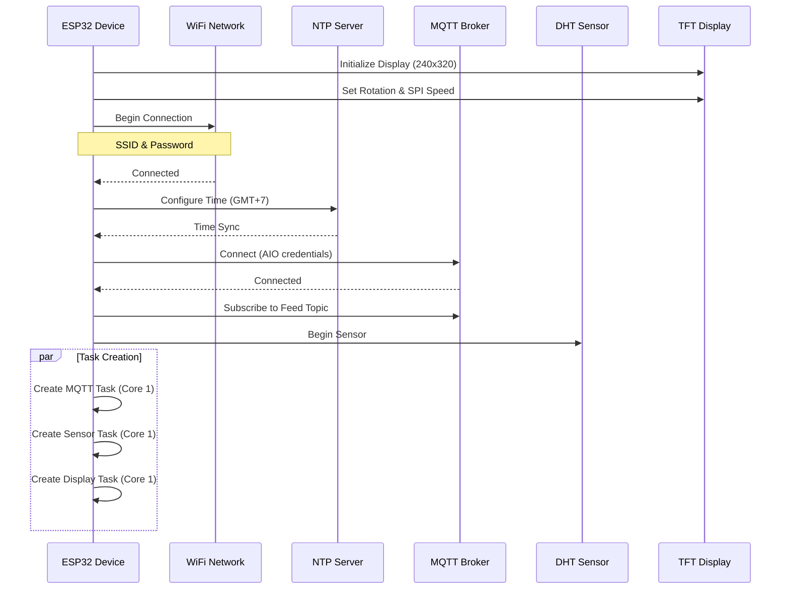
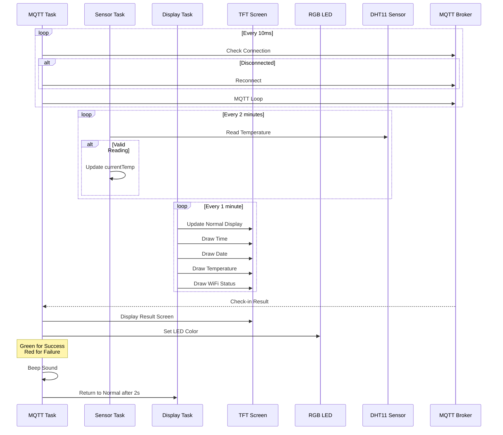
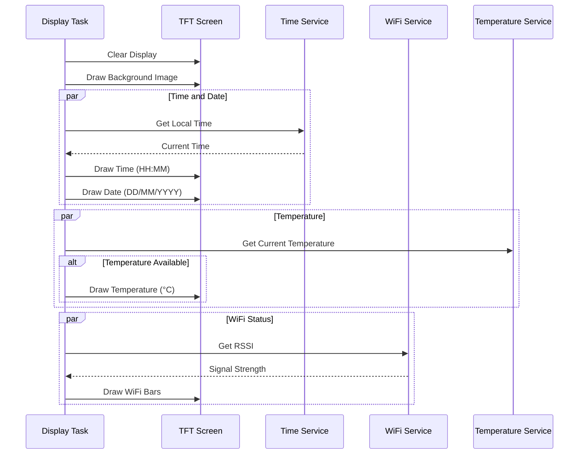

# Sequence Diagrams - ESP32 Face Check-In Device

## 1. Device Initialization Flow

## 2. Main Operation Flow

## 3. Display Update Flow

## System Components

### Hardware Components
- ESP32 Development Board
- TFT ST7789 Display (240x320)
- DHT11 Temperature Sensor
- RGB LED
- Buzzer
- GPIO Connections:
  - TFT_CS: GPIO5
  - TFT_DC: GPIO16
  - TFT_RST: GPIO17
  - TFT_BL: GPIO4
  - TFT_SCK: GPIO18
  - TFT_MOSI: GPIO23
  - LED_R: GPIO19
  - LED_G: GPIO21
  - LED_B: GPIO22
  - BUZZER: GPIO27
  - DHT: GPIO14

### Software Tasks
1. **MQTT Task**
   - Priority: 1
   - Core: 1
   - Stack: 4096 bytes
   - Function: Handle MQTT communication

2. **Sensor Task**
   - Priority: 1
   - Core: 1
   - Stack: 2048 bytes
   - Function: Read temperature every 2 minutes

3. **Display Task**
   - Priority: 1
   - Core: 1
   - Stack: 4096 bytes
   - Function: Update display every minute

### Network Configuration
- WiFi Connection
- NTP Time Sync (GMT+7)
- MQTT Connection to Adafruit IO
  - Port: 1883
  - Subscribe to feed topic for check-in results

### Display States
1. **Normal Display**
   - Time (top-left)
   - Date (top-right)
   - Temperature (bottom-right)
   - WiFi signal strength (bottom-left)
   - Background image

2. **Result Display**
   - Success/Failure image
   - LED indication (Green/Red)
   - Buzzer feedback
   - Auto-return to normal after 2 seconds 