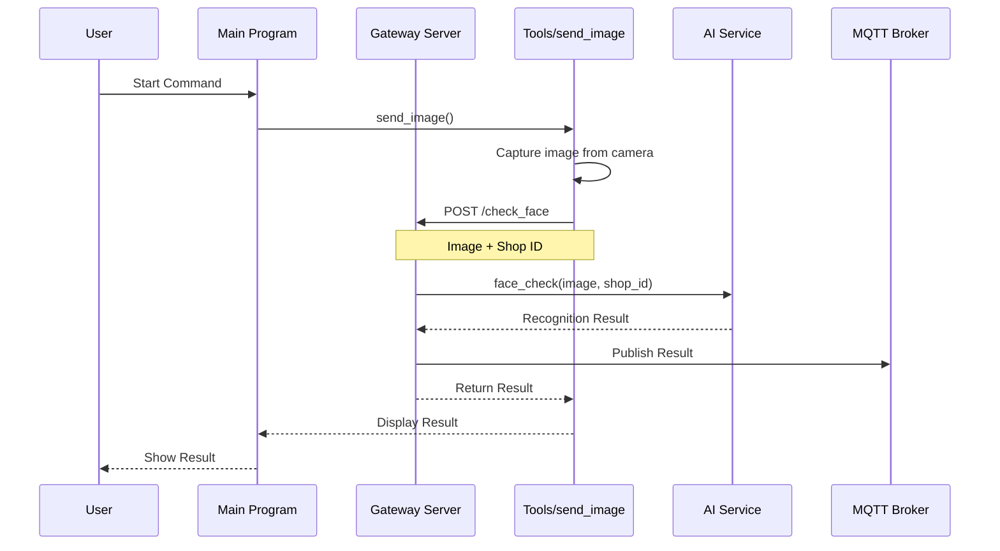
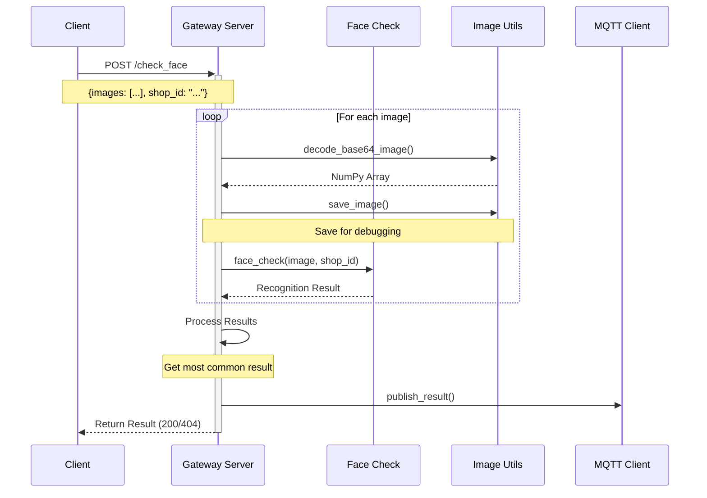
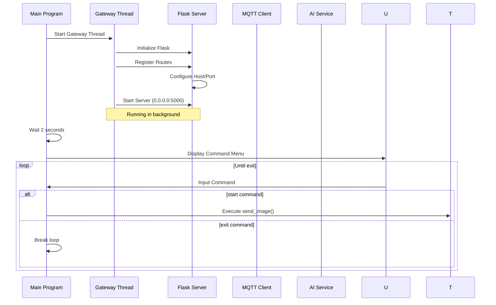
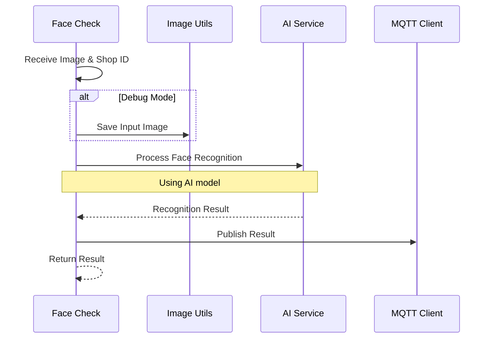

# Sequence Diagrams - Shop Gateway System

## 1. Manual Image Capture Flow



## 2. API Face Check Flow



## 3. Gateway Startup Flow



## 4. Face Check Processing Flow



## System Components

### 1. Main Components
- **Gateway Server**: Flask-based HTTP server
- **Face Check Module**: Face recognition processing
- **Image Utils**: Image handling utilities
- **MQTT Client**: Communication with IoT devices
- **Tools**: Testing and utility scripts

### 2. Data Flow
1. **Image Input**
   - Camera capture
   - Base64 encoded images
   - Image file upload

2. **Processing**
   - Image decoding
   - Face recognition
   - Result aggregation

3. **Output**
   - MQTT publishing
   - HTTP response
   - Debug image saving

### 3. Communication Protocols
- **HTTP/REST**
  - POST /check_face
  - Multipart form data
  - JSON responses

- **MQTT**
  - Topic-based messaging
  - Result publishing
  - Device communication

### 4. Error Handling
- Image validation
- Face detection errors
- Connection issues
- Service errors

## API Specifications

### POST /check_face
- **Purpose**: Process face recognition request
- **Input**:
  ```json
  {
    "images": ["base64_image1", "base64_image2", ...],
    "shop_id": "shop_identifier"
  }
  ```
- **Output**:
  ```json
  {
    "result": "recognition_result"
  }
  ```
- **Status Codes**:
  - 200: Success
  - 400: Invalid input
  - 404: Face not found
  - 500: Server error

## Development Setup
1. **Environment**:
   - Python 3.x
   - Flask server
   - OpenCV
   - MQTT client

2. **Configuration**:
   - Server port: 5000
   - Debug mode
   - MQTT settings
   - Image storage paths

3. **Testing**:
   - Manual camera test
   - API endpoint testing
   - MQTT communication test 