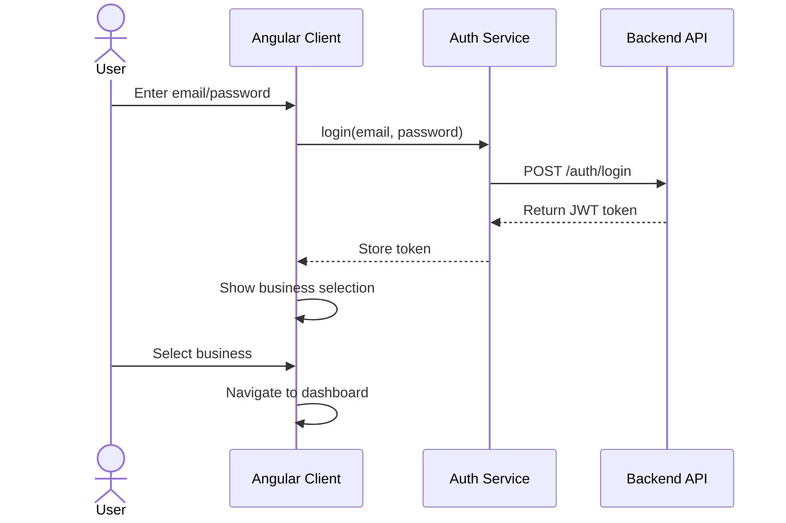
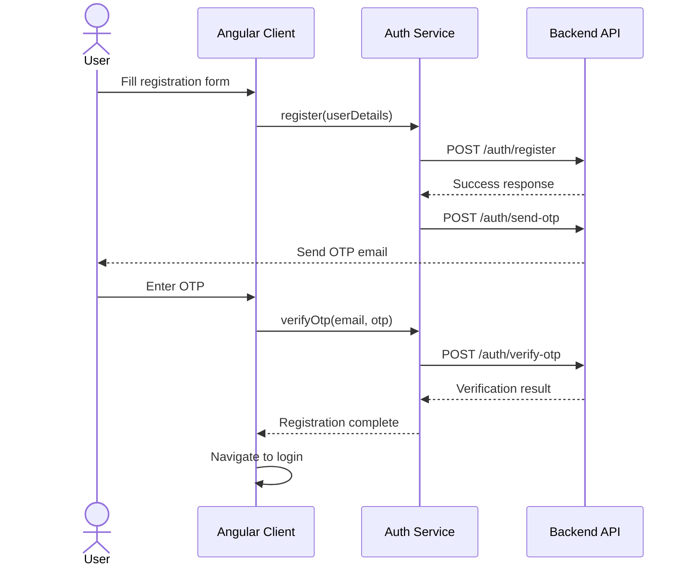
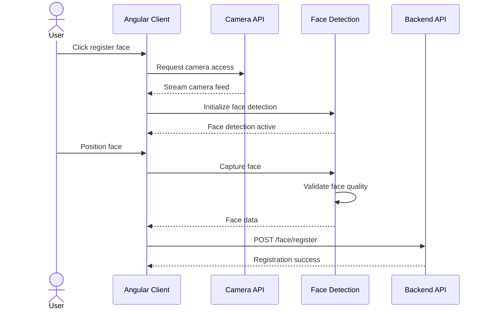
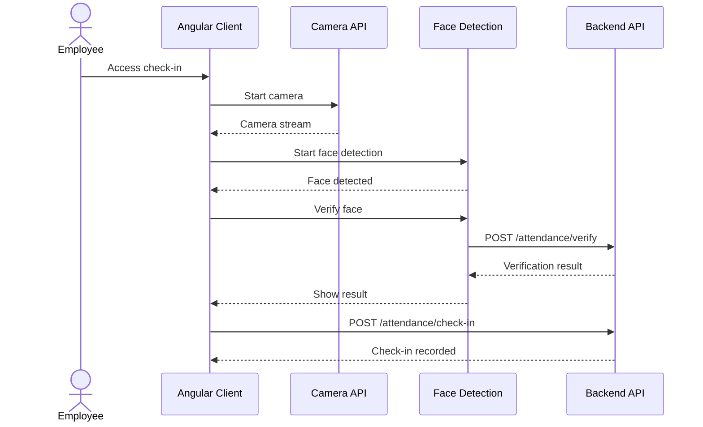
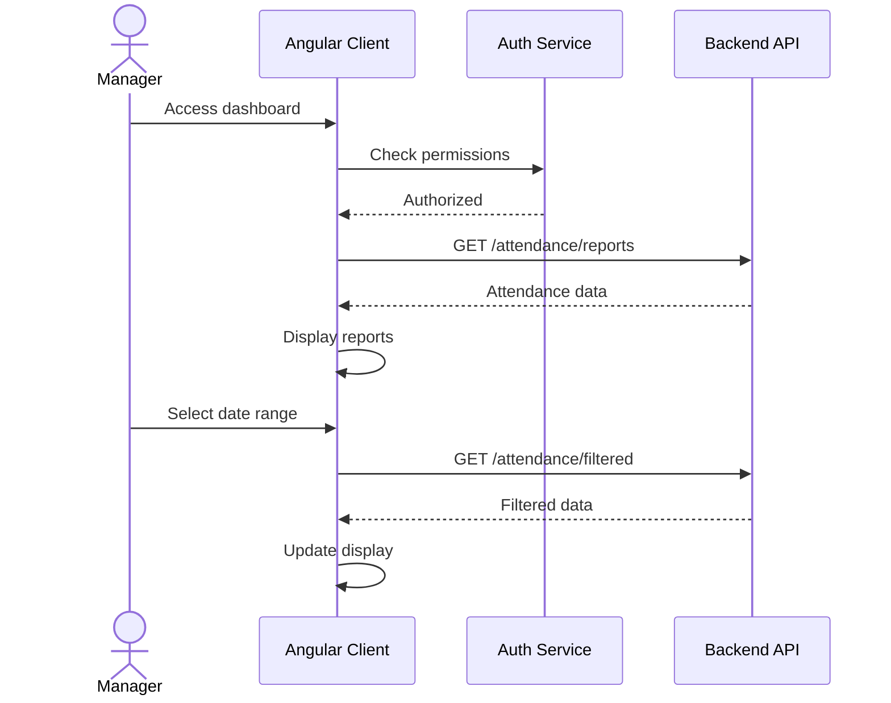
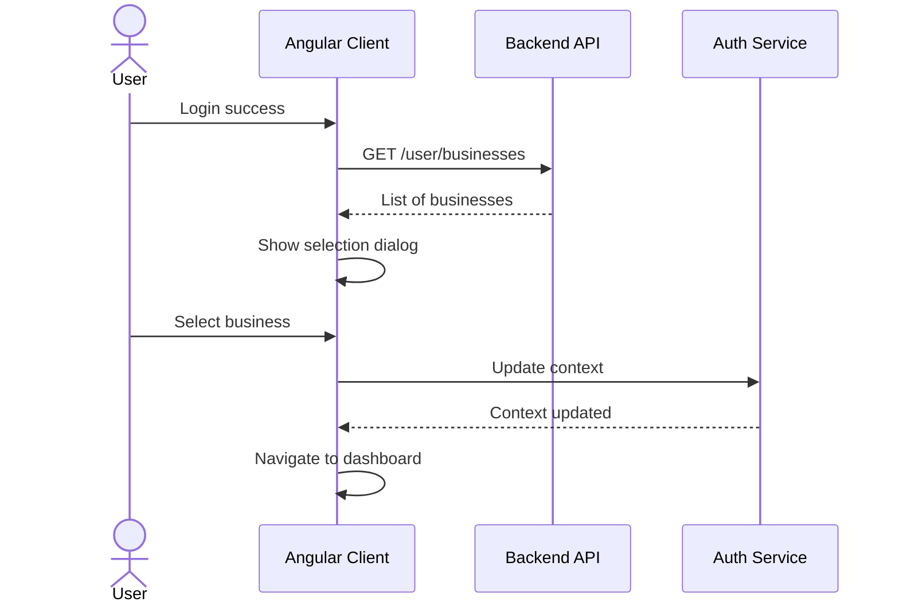

# Sequence Diagrams

## Authentication Flow

```mermaid
sequenceDiagram
    actor User
    participant Client as Angular Client
    participant Auth as Auth Service
    participant API as Backend API
    
    User->>Client: Enter email/password
    Client->>Auth: login(email, password)
    Auth->>API: POST /auth/login
    API-->>Auth: Return JWT token
    Auth-->>Client: Store token
    Client->>Client: Show business selection
    User->>Client: Select business
    Client->>Client: Navigate to dashboard
```

## Registration Flow

```mermaid
sequenceDiagram
    actor User
    participant Client as Angular Client
    participant Auth as Auth Service
    participant API as Backend API
    
    User->>Client: Fill registration form
    Client->>Auth: register(userDetails)
    Auth->>API: POST /auth/register
    API-->>Auth: Success response
    Auth->>API: POST /auth/send-otp
    API-->>User: Send OTP email
    User->>Client: Enter OTP
    Client->>Auth: verifyOtp(email, otp)
    Auth->>API: POST /auth/verify-otp
    API-->>Auth: Verification result
    Auth-->>Client: Registration complete
    Client->>Client: Navigate to login
```

## Face Registration Flow

```mermaid
sequenceDiagram
    actor User
    participant Client as Angular Client
    participant Camera as Camera API
    participant Face as Face Detection
    participant API as Backend API
    
    User->>Client: Click register face
    Client->>Camera: Request camera access
    Camera-->>Client: Stream camera feed
    Client->>Face: Initialize face detection
    Face-->>Client: Face detection active
    User->>Client: Position face
    Client->>Face: Capture face
    Face->>Face: Validate face quality
    Face-->>Client: Face data
    Client->>API: POST /face/register
    API-->>Client: Registration success
```

## Attendance Check-in Flow

```mermaid
sequenceDiagram
    actor Employee
    participant Client as Angular Client
    participant Camera as Camera API
    participant Face as Face Detection
    participant API as Backend API
    
    Employee->>Client: Access check-in
    Client->>Camera: Start camera
    Camera-->>Client: Camera stream
    Client->>Face: Start face detection
    Face-->>Client: Face detected
    Client->>Face: Verify face
    Face->>API: POST /attendance/verify
    API-->>Face: Verification result
    Face-->>Client: Show result
    Client->>API: POST /attendance/check-in
    API-->>Client: Check-in recorded
```

## Dashboard Data Flow

```mermaid
sequenceDiagram
    actor Manager
    participant Client as Angular Client
    participant Auth as Auth Service
    participant API as Backend API
    
    Manager->>Client: Access dashboard
    Client->>Auth: Check permissions
    Auth-->>Client: Authorized
    Client->>API: GET /attendance/reports
    API-->>Client: Attendance data
    Client->>Client: Display reports
    Manager->>Client: Select date range
    Client->>API: GET /attendance/filtered
    API-->>Client: Filtered data
    Client->>Client: Update display
```

## Business Selection Flow

```mermaid
sequenceDiagram
    actor User
    participant Client as Angular Client
    participant API as Backend API
    participant Auth as Auth Service
    
    User->>Client: Login success
    Client->>API: GET /user/businesses
    API-->>Client: List of businesses
    Client->>Client: Show selection dialog
    User->>Client: Select business
    Client->>Auth: Update context
    Auth-->>Client: Context updated
    Client->>Client: Navigate to dashboard
``` 