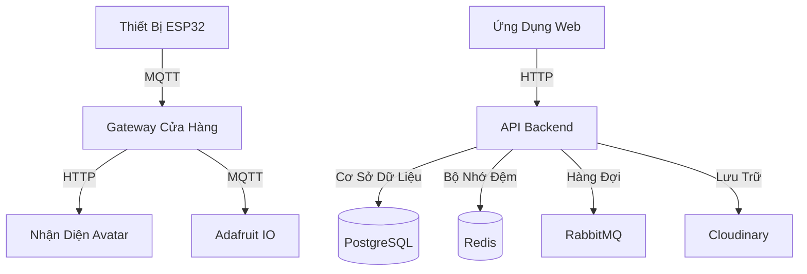

# CO3109 - Đồ Án Đa Ngành: Hệ Thống Điểm Danh Bằng Nhận Diện Khuôn Mặt

Một hệ thống điểm danh toàn diện dựa trên công nghệ nhận diện khuôn mặt, kết hợp thiết bị phần cứng, xử lý AI và giao diện quản lý web để cung cấp giải pháp điểm danh hiện đại cho doanh nghiệp.

## 🌟 Tổng Quan Hệ Thống

Dự án bao gồm nhiều thành phần kết nối với nhau để tạo thành một giải pháp quản lý điểm danh hoàn chỉnh:

### Các Thành Phần Chính

1. **Ứng Dụng Web (Angular)** - `CO3109-Web-Client-Angular/`
   - Giao diện người dùng cho doanh nghiệp và nhân viên
   - Đăng ký và quản lý khuôn mặt
   - Bảng điều khiển và báo cáo điểm danh
   - Kiểm soát truy cập theo vai trò

2. **API Backend (GoLang)** - `CO3109-API-GoLang/`
   - Dịch vụ RESTful API
   - Quản lý người dùng và doanh nghiệp
   - Xác thực và phân quyền
   - Lưu trữ dữ liệu và xử lý logic nghiệp vụ

3. **Thiết Bị Điểm Danh (ESP32)** - `CO3109-Face-Check-In/`
   - Thiết bị phần cứng chụp ảnh khuôn mặt
   - Phát hiện khuôn mặt thời gian thực
   - Tích hợp MQTT để giao tiếp với máy chủ
   - Giao diện hiển thị TFT tương tác

4. **Gateway Cửa Hàng (Python)** - `CO3109-Shop-Gateway-Python/`
   - Xử lý và xác minh khuôn mặt
   - Giao tiếp MQTT với thiết bị
   - Xử lý và lưu trữ ảnh tạm thời
   - Tích hợp với dịch vụ AI

5. **Dịch Vụ Nhận Diện (Python)** - `CO3109-Avatar-Recognize-Python/`
   - Nhận diện khuôn mặt bằng AI
   - Trích xuất đặc trưng khuôn mặt
   - So sánh với khuôn mặt đã đăng ký
   - Khả năng xử lý thời gian thực

## 🔧 Công Nghệ Sử Dụng

- **Frontend**: Angular 15.2.0, Angular Material
- **Backend**: Go 1.23.8, PostgreSQL
- **Xử Lý AI**: Python, OpenCV, Thư viện Face Recognition
- **Thiết Bị IoT**: ESP32, FreeRTOS, Arduino Framework
- **Giao Tiếp**: MQTT, REST APIs
- **Lưu Trữ**: PostgreSQL, Redis, Cloudinary
- **Hàng Đợi**: RabbitMQ

## 🏗 Kiến Trúc Hệ Thống

## 📦 Cài Đặt & Thiết Lập

Mỗi thành phần có hướng dẫn cài đặt riêng. Vui lòng tham khảo các tệp README trong thư mục của từng thành phần:

- [Cài Đặt Ứng Dụng Web](./CO3109-Web-Client-Angular/README.md)
- [Cài Đặt API Backend](./CO3109-API-GoLang/README.md)
- [Cài Đặt Thiết Bị Điểm Danh](./CO3109-Face-Check-In/README.md)
- [Cài Đặt Gateway Cửa Hàng](./CO3109-Shop-Gateway-Python/README.md)
- [Cài Đặt Dịch Vụ Nhận Diện](./CO3109-Avatar-Recognize-Python/README.md)

## 🚀 Bắt Đầu Sử Dụng

1. Thiết lập dịch vụ API Backend
2. Triển khai ứng dụng Web Client
3. Cấu hình và triển khai Gateway Cửa Hàng
4. Thiết lập dịch vụ Nhận Diện Avatar
5. Lập trình và triển khai thiết bị ESP32
6. Cấu hình kết nối MQTT và biến môi trường

## 🔐 Tính Năng Bảo Mật

- Xác thực dựa trên JWT
- Kiểm soát truy cập theo vai trò
- Truyền dữ liệu khuôn mặt an toàn
- Lưu trữ mã hóa
- Thực thi HTTPS
- Quản lý khóa API

## 📱 Tính Năng

### Quản Lý Doanh Nghiệp
- Hỗ trợ nhiều doanh nghiệp
- Quản lý nhân viên
- Theo dõi điểm danh
- Báo cáo và phân tích

### Nhận Diện Khuôn Mặt
- Phát hiện khuôn mặt thời gian thực
- Trích xuất đặc trưng khuôn mặt
- Độ chính xác cao khi so khớp
- Thời gian phản hồi nhanh

### Quản Lý Thiết Bị
- Cấu hình thiết bị từ xa
- Giám sát trạng thái
- Cập nhật firmware
- Xử lý lỗi

### Giao Diện Người Dùng
- Thiết kế web đáp ứng
- Bảng điều khiển tương tác
- Cập nhật thời gian thực
- Tương thích thiết bị di động

## 🛠 Phát Triển

### Yêu Cầu Hệ Thống
- Node.js và npm
- Go 1.23.8
- Python 3.8+
- Docker và Docker Compose
- PostgreSQL
- Redis
- RabbitMQ
- Môi trường phát triển ESP32

### Công Cụ Phát Triển
- VS Code hoặc IDE ưa thích
- PlatformIO cho phát triển ESP32
- Postman để kiểm thử API
- Git để quản lý mã nguồn

## 📄 Tài Liệu

- Tài Liệu API: Có sẵn qua Swagger tại `http://[api-host]/swagger/index.html`
- Tài Liệu Thành Phần: Xem các tệp README trong thư mục của từng thành phần
- Tài Liệu Kiến Trúc: Có sẵn trong wiki dự án

## 🤝 Đóng Góp

Dự án này là một phần của môn CO3109-Đồ Án Đa Ngành tại HCMUT. Chúng tôi chào đón các đóng góp thông qua:
- Báo cáo lỗi
- Đề xuất tính năng
- Pull request
- Cải thiện tài liệu

## 📝 Giấy Phép

Dự án này được cấp phép theo Giấy Phép MIT - xem tệp LICENSE để biết chi tiết.

## 👥 Nhóm Phát Triển

- Nhóm Phát Triển Backend
- Nhóm Phát Triển Frontend
- Nhóm Phát Triển Thiết Bị IoT
- Nhóm AI/ML
- Nhóm Tích Hợp
